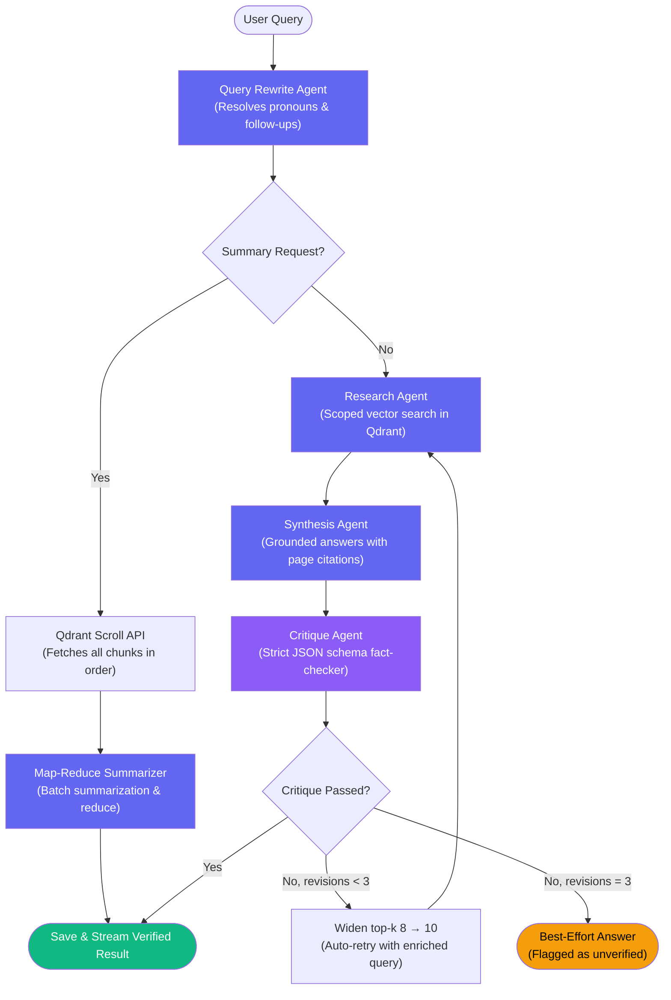

# SynapseDocs AI: Autonomous Multi-Agent Document Intelligence & Research Platform

[](https://www.python.org/downloads/)
[](https://fastapi.tiangolo.com/)
[](https://langchain-ai.github.io/langgraph/)
[](https://react.dev/)
[](https://github.com/dishajain260)

**SynapseDocs AI** is an enterprise-grade autonomous **Retrieval-Augmented Generation (RAG)** platform designed to ingest complex PDF documents (including multi-row financial and technical tables), perform self-correcting vector retrieval via **LangGraph**, and synthesize cited answers with automated critique fact-checking.

Developed by **[Disha Jain](https://github.com/dishajain260)**.

---

## 🌟 Key Technical Highlights

* **Autonomous Multi-Agent Orchestration**: Specialized LangGraph state graph with dedicated nodes for Conversational Disambiguation, Dense Vector Search, Grounded Synthesis, and JSON Schema Critique Verification.
* **Table-Aware Row-Boundary Chunking**: Utilizes PyMuPDF's `find_tables()` to detect tables, repeat header rows across chunk boundaries, and prevent tabular fragmentation during embedding.
* **Self-Correcting Critique & Retry Loop**: Answers are audited by a critique agent against retrieved source chunks; low completeness or ungrounded claims trigger widening retries (`top_k=8 → 10`).
* **Interactive Citation Inspector & Report Export**: Click any cited source to inspect exact vector matches, similarity scores, page numbers, and chunk text in real time. Export full research briefs to Markdown (`.md`).
* **Multi-Tenant Vector & Relational Isolation**: Deterministic point IDs (`md5(user_id + ":" + chunk_id)`) and indexed Qdrant payload filters structurally enforce cross-user privacy.
* **Serverless Scale Architecture**: FastEmbed ONNX runtime for ultra-low memory footprints, Neon Serverless PostgreSQL for session history, and Groq Cloud LPU inference.

---

## 📐 Architecture & Agent Topology



---

## 🤖 Agent Roles & Capabilities

| Agent Node | Technology / Model | Core Function |
| :--- | :--- | :--- |
| **Query Rewrite** | Groq `llama-3.1-8b-instant` | Resolves conversational follow-up questions (e.g., *"what about the revenue growth?"*) into standalone search queries using past turns. |
| **Research Node** | `fastembed` ONNX + Qdrant Cloud | Embeds queries locally via ONNX Runtime (`BAAI/bge-small-en-v1.5`) and executes filtered vector search scoped to `user_id` and `source_file`. |
| **Synthesis Node** | `openai/gpt-oss-120b` (Groq) | Synthesizes comprehensive answers strictly grounded in retrieved passages with exact page citations `(Page X)`. |
| **Critique Node** | `openai/gpt-oss-120b` (Groq) | Enforces structured JSON validation (`{passed: bool, feedback: str}`) to verify grounding, accuracy, and relevance. |
| **Summarizer** | `openai/gpt-oss-120b` (Groq) | Runs whole-document Map-Reduce over ~4,500-word batches for complete document coverage. |

---

## 📊 Evaluation & Benchmarks (RAGAS)

Evaluated against comprehensive single-hop, multi-hop, and out-of-scope query suites:

| Metric | Score | Assessment |
| :--- | :--- | :--- |
| **Faithfulness** | **0.954** | Exceptional claim grounding with minimal unsupported statements. |
| **Answer Relevancy** | **0.795** | Concise, direct answers without unnecessary filler. |
| **Context Precision** | **0.724** | High signal-to-noise ratio in retrieved context chunks. |
| **Context Recall** | **1.000** | Complete capture of required reference facts from source PDFs. |

---

## 💻 Tech Stack

* **Agent Orchestration**: LangGraph, LangChain
* **LLM Provider**: Groq Cloud API (`gpt-oss-120b`, `llama-3.1-8b-instant`)
* **Embedding Model**: FastEmbed ONNX Runtime (`BAAI/bge-small-en-v1.5`)
* **Vector Store**: Qdrant Cloud (Cosine metric, indexed payload filtering)
* **Relational Database**: Neon Serverless PostgreSQL, SQLAlchemy 2.0 (async + `NullPool`)
* **Backend Framework**: FastAPI, Pydantic v2, Server-Sent Events (SSE)
* **Frontend**: React 19, Vite, React Markdown, Remark GFM
* **Auth**: Stateless JWT Bearer tokens + 1-click Demo guest sessions

---

## 🚀 Quick Start Guide

### 1. Prerequisites
* Python 3.10+
* Node.js 18+
* API keys for Groq, Qdrant Cloud, and Neon PostgreSQL

### 2. Backend Setup

```bash
cd backend

# Create or activate virtual environment
source venv/bin/activate

# Install dependencies
pip install -r requirements.txt

# Start the FastAPI server
uvicorn api.main:app --reload --port 8000
```

### 3. Frontend Setup

```bash
cd frontend

# Install dependencies
npm install

# Start Vite dev server
npm run dev
```

Open `http://localhost:5173` to access the SynapseDocs AI workspace.

---

## 👤 Author

**Disha Jain**  
GitHub: [@dishajain260](https://github.com/dishajain260)  
Repository: [Multiagent_Research_Project](https://github.com/dishajain260/Multiagent_Research_Project)

